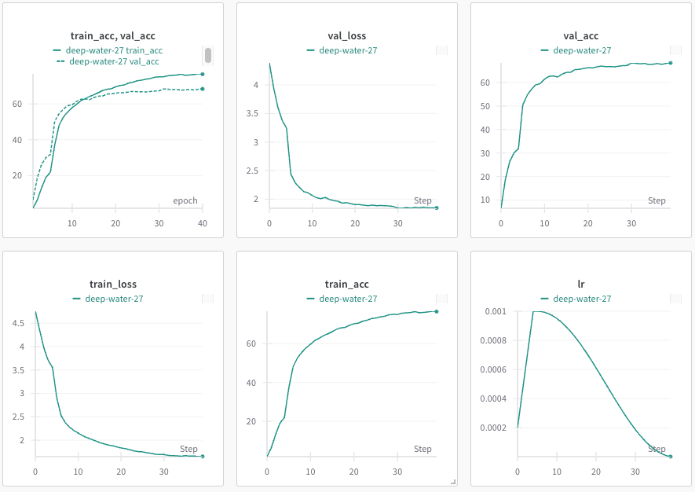

# DS542 Midterm Challenge Report

## AI Disclosure

AI assistance was utilized throughout this project primarily for code implementation, debugging, and incorporating regularization/generalization techniques based on external research.

- **`starter_code.py` (Baseline):** ChatGPT (o3-mini-high, referred to as ChatGPT) was used to help complete the initial starter code, define the simple CNN architecture, and establish a baseline performance measurement pipeline.
- **`predefined_untrained.py` (ResNet18 Integration):** ChatGPT assisted in integrating the ResNet18 architecture into the existing code structure, focusing on modifying necessary sections rather than wholesale code replacement, to maintain consistency. Modifications included adapting ResNet18 for 32x32 inputs.
- **Mixup Implementation:** After researching methods to improve model generalization online, ChatGPT was used to help implement the Mixup data augmentation technique into the training loop for `predefined_untrained.py`.
- **`predefined_trained.py` (Pretrained ResNet18 & Evaluation):** ChatGPT assisted in adapting the codebase to use the pretrained weights for ResNet18, including handling the necessary image transformations (upscaling to 224x224). When issues arose with the original OOD evaluation script (`eval_ood.py`) due to the changed input requirements, ChatGPT helped create a modified version, `eval_ood_pretrained.py`, to correctly process inputs for the pretrained model, ensuring compatibility without altering previous working versions.
- **CutMix Implementation:** Following further research into generalization techniques, ChatGPT was consulted to help implement the CutMix augmentation method into `predefined_trained.py`.
- **`predefined_trained_v2.py` (Self-Distillation & TTA):** After researching advanced training and evaluation strategies online, Claude (Sonnet 3.7 equivalent, referred to as Claude) and ChatGPT were used to help implement Self-Distillation and Test-Time Augmentation (TTA) concepts into the `predefined_trained_v2.py` script for experimentation.

## Model Description

### Part 1: `starter_code.py` (Simple CNN)

- A custom Convolutional Neural Network (CNN) was implemented as an initial baseline, following a common pattern often used for introductory image classification tasks.
- **Architecture:** The network is composed of a feature extractor followed by a classifier.
    - **Feature Extractor (`self.features`):** This part processes the input image (3x32x32 for CIFAR-100) through sequential blocks to learn hierarchical features.
        - **Block Structure:** Each block follows the standard Conv-BatchNorm-ReLU-MaxPool sequence.
            - `nn.Conv2d`: Performs convolution using 3x3 kernels with padding=1 to preserve spatial dimensions within the convolution operation itself. The number of output channels increases progressively (3 -> 32 -> 64 -> 128) across blocks, allowing the network to learn increasingly complex features.
            - `nn.BatchNorm2d`: Normalizes the activations across the batch, stabilizing training and often improving convergence speed and performance. It's placed after the convolution and before the activation function.
            - `nn.ReLU(inplace=True)`: Applies the Rectified Linear Unit activation function element-wise, introducing non-linearity which is crucial for learning complex patterns. `inplace=True` modifies the input directly to save memory.
            - `nn.MaxPool2d(kernel_size=2, stride=2)`: Performs max pooling over 2x2 regions with a stride of 2. This progressively reduces the spatial dimensions (height and width) of the feature maps (32x32 -> 16x16 -> 8x8 -> 4x4), making the representation more robust to small spatial variations and reducing computational cost in later layers.
        - **Block Progression:**
            - Block 1: 3 input channels -> 32 output channels. Output feature map size: 16x16.
            - Block 2: 32 input channels -> 64 output channels. Output feature map size: 8x8.
            - Block 3: 64 input channels -> 128 output channels. Output feature map size: 4x4.
    - **Classifier (`self.classifier`):** This part takes the flattened output from the feature extractor and performs classification.
        - `Flattening`: The output tensor from `self.features` (shape: BatchSize x 128 x 4 x 4) is flattened into a vector (BatchSize x 2048, since 128 * 4 * 4 = 2048).
        - `nn.Dropout(0.5)`: Applies dropout regularization with a probability of 0.5 during training. This randomly sets a fraction of input units to 0 at each update, helping to prevent overfitting by reducing co-adaptation of neurons.
        - `nn.Linear(128 * 4 * 4, 256)`: A fully connected layer that transforms the flattened feature vector into an intermediate representation of size 256.
        - `nn.ReLU(inplace=True)`: Another non-linear activation function.
        - `nn.Linear(256, 100)`: The final fully connected layer that outputs 100 scores, corresponding to the 100 classes in the CIFAR-100 dataset.
- **Rationale:** This architecture represents a standard, relatively shallow CNN designed to capture basic spatial hierarchies in images. It serves as a fundamental building block and a necessary first step to establish a working training and evaluation pipeline before moving to more complex, predefined architectures like ResNet.

### Part 2: `predefined_untrained.py` (ResNet18 Untrained)

- **Motivation & Selection:** To improve upon the baseline Simple CNN, a more sophisticated, established architecture was chosen. Research comparing common architectures like VGG and ResNet on benchmark datasets (including CIFAR) suggested that ResNet architectures often achieve better performance, potentially due to their residual connections mitigating gradient issues in deeper networks. ResNet18 was selected as a balance between increased depth/complexity compared to the Simple CNN and computational feasibility.
- **Core ResNet Architecture:** ResNet (Residual Network) introduced the concept of "skip connections" or "residual blocks."
    - **Residual Block:** Instead of learning a direct mapping `H(x)` from input `x`, a residual block learns a residual mapping `F(x) = H(x) - x`. The original input `x` is then added back to the output of the convolutional layers via a shortcut connection (`H(x) = F(x) + x`).
    - **Benefits:** This allows gradients to flow more easily during backpropagation, enabling the training of much deeper networks without suffering from the vanishing gradient problem as severely as earlier deep models like VGG. It also makes it easier for layers to learn an identity mapping if needed, meaning adding more layers shouldn't degrade performance.
    - **ResNet18 Structure:** This specific variant uses basic residual blocks, typically consisting of two 3x3 convolutional layers each, along with batch normalization and ReLU activations. The "18" refers to the number of layers with trainable weights (convolutional and fully connected).
- **Initialization:** Crucially, for this part, the ResNet18 model was initialized **without** pretrained ImageNet weights (`pretrained=False`). The goal was to train the network entirely from scratch on the CIFAR-100 dataset.
- **Modifications for CIFAR-100 (32x32 Input):** Standard ResNet18 is designed for larger ImageNet inputs (e.g., 224x224). To adapt it effectively for the smaller 32x32 CIFAR-100 images, the following modifications were made to the initial layers:
    - **Initial Convolution (`model.conv1`):** The original `conv1` uses a large 7x7 kernel with a stride of 2, which drastically reduces spatial resolution early on. This was replaced with a smaller 3x3 kernel, stride 1, and padding 1 (`nn.Conv2d(3, 64, kernel_size=3, stride=1, padding=1, bias=False)`). This change preserves more spatial information from the small input images.
    - **Initial Max Pooling (`model.maxpool`):** The original `MaxPool2d` layer following `conv1` (also with stride 2) was removed by replacing it with an `nn.Identity()` layer. This further prevents excessive downsampling early in the network, which is beneficial for smaller input images.
- **Classifier Head:** Similar to Part 1, the final fully connected layer (`model.fc`) designed for ImageNet's 1000 classes was replaced.
    - The input to the classifier is the 512-dimensional feature vector output by the ResNet backbone's average pooling layer.
    - A sequence of `nn.Dropout(0.5)` followed by `nn.Linear(512, 100)` was used to adapt the model for the 100-class CIFAR-100 classification task and add regularization.
- **Data Augmentation Strategy:** To improve generalization and prevent overfitting when training from scratch, several augmentation techniques were applied during training:
    - `transforms.RandomCrop(32, padding=4)`: Randomly crops a 32x32 patch from the image after padding it with 4 pixels on each side. This encourages the model to learn features that are robust to variations in object position and scale.
    - `transforms.RandomHorizontalFlip()`: Randomly flips the image horizontally with a default probability of 0.5. This helps the model learn features that are invariant to left-right orientation.
    - **Mixup:** Implemented within the training loop (`mixup_data` function). Mixup creates new training examples by linearly interpolating pairs of images and their corresponding labels. This acts as a strong form of regularization, encouraging smoother decision boundaries and improving robustness to adversarial examples. *(The alpha parameter controlling the interpolation strength was explored during experimentation).*
- **Rationale:** This part aimed to evaluate the effectiveness of a deeper, more sophisticated architecture (ResNet18) trained from scratch on the target dataset, incorporating necessary modifications to handle the specific input dimensions of CIFAR-100 and utilizing standard data augmentation techniques to enhance performance.

### Part 3: `predefined_trained.py` & `predefined_trained_v2.py` (ResNet18 Pretrained & Refinements)

- **Leveraging Transfer Learning:** This part shifted to using transfer learning by initializing `torchvision.models.resnet18` **with** pretrained weights learned on the large-scale ImageNet dataset (`pretrained=True` or `weights=ResNet18_Weights.DEFAULT`). The hypothesis was that features learned on ImageNet (edges, textures, basic shapes) would be beneficial for CIFAR-100 classification, allowing the model to achieve higher accuracy with potentially less training data/time compared to training from scratch.
- **Input Adaptation:** As the pretrained ResNet18 expects 224x224 input images, the CIFAR-100 images (32x32) were transformed accordingly during data loading using `transforms.Resize(256)` followed by `transforms.CenterCrop(224)` for validation/test and `transforms.RandomResizedCrop(224)` during training.
- **Fine-tuning Strategy:** A standard fine-tuning approach was employed:
    - **Initial Freeze:** All parameters in the pretrained ResNet backbone were initially frozen (`param.requires_grad = False`). Only the parameters of the newly added classifier head (`model.fc`, adapted for 100 classes with Dropout) were trainable.
    - **Warmup Phase:** The classifier head was trained for a set number of `warmup_epochs` (e.g., 5 epochs) with a linearly increasing learning rate (`adjust_learning_rate` function). This allows the randomly initialized classifier to adapt to the pretrained features without destabilizing the backbone.
    - **Unfreezing & Joint Training:** After the warmup, the backbone parameters were unfrozen (`param.requires_grad = True`) and added to the optimizer with a significantly lower learning rate (`backbone_lr`) compared to the classifier's learning rate. The entire model was then trained jointly, allowing the pretrained features to be slightly adjusted for the specific nuances of the CIFAR-100 dataset. A cosine annealing learning rate schedule was typically applied after unfreezing.
- **Necessity of `eval_ood_pretrained.py`:** The use of pretrained weights necessitated resizing CIFAR-100 images to 224x224 during training and standard evaluation. However, the original Out-of-Distribution (OOD) evaluation script (`eval_ood.py`) loaded pre-generated OOD datasets (e.g., `distortionXX.npy`) which were based on the original 32x32 CIFAR images. Feeding these directly to the fine-tuned 224x224 model would lead to incorrect predictions due to mismatched input dimensions and normalization statistics. Therefore, `eval_ood_pretrained.py` was created. This modified script specifically incorporates the necessary `torch.nn.functional.interpolate` step to resize the loaded OOD images to 224x224 and applies the ImageNet normalization statistics *before* feeding them to the model for evaluation, ensuring consistency with how the model was trained and evaluated on the standard test set.
- **Version 1 (`predefined_trained.py`): Core Techniques**
    - **Optimizer:** Used the standard `torch.optim.Adam` optimizer.
    - **Augmentation:** Employed a combination of strong augmentation techniques suitable for fine-tuning:
        - `transforms.RandomResizedCrop(224)`
        - `transforms.RandomHorizontalFlip()`
        - `RandAugment()`: Applies a sequence of randomly selected augmentations (e.g., rotation, shear, color adjustments) with random magnitudes.
        - **Mixup & CutMix:** Both techniques (`mixup_data`, `cutmix_data`) were implemented and could be enabled via the `CONFIG` dictionary to further regularize the model and improve robustness by creating composite training examples.
- **Version 2 (`predefined_trained_v2.py`): Experimental Variations**
    - This version served as a testbed for alternative optimization and augmentation strategies based on further research.
    - **Optimizer Change:** Switched from `Adam` to `torch.optim.AdamW`. AdamW decouples weight decay from the gradient update, which is often found to improve generalization compared to standard Adam's L2 regularization implementation.
    - **Augmentation Change:** Replaced `RandAugment` with `TrivialAugmentWide()`. TrivialAugment is a simpler yet often effective augmentation policy that applies a single augmentation chosen uniformly from a predefined set, with the magnitude also chosen uniformly.
    - **Test-Time Augmentation (TTA):** Code for TTA (`test_time_augmentation`, `evaluate_with_tta`) was implemented. TTA involves creating multiple augmented versions of each test image, obtaining predictions for each, and averaging the results. *While implemented, this technique was not used in the final evaluation run submitted, due to time constraints and lack of significant improvement in initial tests.*

## Hyperparameter Tuning

Hyperparameter tuning was an iterative process throughout the project.

- **Learning Rate:**
    - **Part 1 (`starter_code.py`):** Initial experiments with SGD used a learning rate of 0.01. Upon switching to the `Adam` optimizer, the learning rate was reduced to 0.001, which yielded better results in fewer epochs.
    - **Part 2 (`predefined_untrained.py`):** The learning rate was kept at 0.001 for the `Adam` optimizer when training the ResNet18 from scratch.
    - **Part 3 (`predefined_trained.py`, `predefined_trained_v2.py`):** For fine-tuning the pretrained ResNet18, a two-stage learning rate approach was adopted following the warmup phase:
        - The classifier head used a base learning rate of 0.001.
        - The unfrozen backbone layers used a lower learning rate of 0.0001 to avoid drastically altering the pretrained features.
        - *Minor experiments adjusting the classifier LR slightly higher and the backbone LR slightly lower after introducing warmup did not yield significant performance changes, so the 0.001/0.0001 rates were retained.*
- **Batch Size:**
    - The `find_optimal_batch_size` utility initially suggested 512 for both MPS and CUDA environments. This size was used for `starter_code.py`, `predefined_untrained.py`, and the initial `predefined_trained.py`.
    - In later versions of `predefined_trained.py` and `predefined_trained_v2.py`, the batch size was explicitly reduced to 256. *The rationale provided for this change was to potentially mitigate overgeneralization, although larger batch sizes often lead to faster training.*
- **Optimizer & Weight Decay:**
    - **Optimizer Choice:** Transitioned from SGD in early `starter_code` experiments to `Adam` for most of the project (`starter_code` final, `predefined_untrained`, `predefined_trained`). `AdamW` was experimented with in `predefined_trained_v2.py` due to its potentially better generalization properties related to weight decay handling.
    - **Optimizer Parameters:** Default parameters for Adam/AdamW (e.g., betas) were largely used.
    - **Weight Decay:** A value of 5e-4 was consistently used across Adam/AdamW optimizations. *Experimenting with different weight decay values showed only minor, often negligible, differences in performance, so the standard 5e-4 was maintained.*
- **Learning Rate Schedulers:**
    - **Part 1 (`starter_code.py`):** Initially used `torch.optim.lr_scheduler.StepLR` with `step_size=1` and `gamma=0.9`. This represents a relatively rapid decay (10% reduction each epoch).
    - **Part 2 (`predefined_untrained.py`):** Switched to `torch.optim.lr_scheduler.CosineAnnealingLR` with `T_max` set to the total number of epochs. This provides a smoother decay following a cosine curve, often beneficial for convergence.
    - **Part 3 (`predefined_trained.py`, `predefined_trained_v2.py`):** Employed a manual linear warmup for the classifier learning rate during the initial `warmup_epochs`. After unfreezing the backbone, `CosineAnnealingLR` was initialized with `T_max` set to the *remaining* epochs, coordinating the decay for both the classifier and backbone parameter groups.
- **Mixup / CutMix Alpha Values:**
    - **CutMix Alpha:** Kept at the commonly used default value of 1.0 when enabled.
    - **Mixup Alpha:** Experimented with values of 0.2 and 0.4. The value 0.2 was found to provide a better balance between regularization benefits (improving generalization) and allowing the model to learn effectively, and was used in the final configurations where Mixup was enabled (`predefined_untrained.py`, `predefined_trained.py`, `predefined_trained_v2.py`).

## Regularization Techniques

Several techniques were employed across the different parts of the project to prevent overfitting and improve the generalization ability of the models:

- **Dropout:** Applied within the final classifier head (`nn.Dropout(0.5)`) in all models (Simple CNN, ResNet18 untrained, ResNet18 fine-tuned). During training, dropout randomly sets a fraction (here, 50%) of neuron activations to zero for each forward pass. This prevents individual neurons from becoming overly reliant on specific inputs or other neurons, forcing the network to learn more robust and distributed representations.
- **Weight Decay (L2 Regularization):** Incorporated directly into the optimizer (`Adam` or `AdamW`) with a consistent value of `5e-4`. Weight decay adds a penalty term to the loss function proportional to the squared magnitude of the model weights. This encourages the network to learn smaller weights, leading to simpler models that are less likely to overfit the training data.
- **Batch Normalization (`nn.BatchNorm2d`):** Used extensively within the convolutional blocks of the Simple CNN (Part 1) and inherently present throughout the ResNet18 architecture (Parts 2 & 3). While primarily known for stabilizing and accelerating training by normalizing layer inputs, batch normalization also introduces a slight regularization effect. The noise introduced by using batch statistics (mean and variance) rather than global statistics during training can make the model slightly more robust.
- **Label Smoothing:** Applied to the `nn.CrossEntropyLoss` criterion during training for both the untrained ResNet18 (Part 2) and the fine-tuned ResNet18 (Part 3). A smoothing value of `0.1` was used in the final configurations *(after experiments with 0.05 showed negligible differences)*. Instead of using hard targets (e.g., `[0, 1, 0]`), label smoothing uses softer targets (e.g., `[0.05, 0.9, 0.05]` for a 3-class problem with smoothing=0.1). This discourages the model from becoming overconfident in its predictions for the training data, potentially leading to better calibration and generalization.
- **Mixup / CutMix:** These data augmentation techniques, described in the Data Augmentation section below, also serve as powerful regularizers. By creating composite training examples (linear interpolations for Mixup, patch replacements for CutMix), they force the model to learn more robust features and make smoother predictions between classes, reducing overfitting. These were employed in Parts 2 and 3.

## Data Augmentation Strategy

Data augmentation techniques varied across the project parts, alongside the crucial aspect of input normalization which depended on the training methodology:

- **Part 1 (`starter_code.py`):**
    - **Augmentations:** *Initially focused on basic transformations. Assumed `transforms.ToTensor()` was the primary step. Confirmation is needed if spatial augmentations like `RandomCrop` or `RandomHorizontalFlip` were added later to the `starter_code.py` baseline.*
    - **Normalization:** Used standard CIFAR-100 mean and standard deviation values: `transforms.Normalize((0.5071, 0.4867, 0.4408), (0.2675, 0.2565, 0.2761))`. This is appropriate as the model was trained from scratch solely on CIFAR-100 data.
- **Part 2 (`predefined_untrained.py`):**
    - **Augmentations (Training):** Applied spatial augmentations including `transforms.RandomCrop(32, padding=4)` and `transforms.RandomHorizontalFlip()`. Mixup was also integrated directly into the training loop (`mixup_data`).
    - **Augmentations (Validation/Test):** Only `transforms.ToTensor()` was used before normalization.
    - **Normalization:** Used the same standard CIFAR-100 normalization statistics as Part 1: `transforms.Normalize((0.5071, 0.4867, 0.4408), (0.2675, 0.2565, 0.2761))`. This is correct because, despite using the ResNet18 architecture, the model was trained *from scratch* on CIFAR-100, not using ImageNet pretraining.
- **Part 3 (`predefined_trained.py`, `predefined_trained_v2.py`):**
    - **Augmentations (Training):** Employed stronger augmentations suitable for fine-tuning and larger input sizes (224x224): `transforms.RandomResizedCrop(224)`, `transforms.RandomHorizontalFlip()`, and either `RandAugment()` (v1) or `TrivialAugmentWide()` (v2). Mixup and CutMix (`mixup_data`, `cutmix_data`) were applied within the training loop.
    - **Augmentations (Validation/Test):** Standard resizing and cropping for pretrained models: `transforms.Resize(256)` followed by `transforms.CenterCrop(224)`, then `transforms.ToTensor()`.
    - **Normalization:** Crucially, used ImageNet mean and standard deviation values: `transforms.Normalize((0.485, 0.456, 0.406), (0.229, 0.224, 0.225))`. This is **required** because the ResNet18 model was initialized with weights pretrained on ImageNet. To leverage these pretrained features effectively, the input data (even though it's CIFAR-100) must be normalized in the same way as the original ImageNet data the model was trained on. This consistency applies to both training and evaluation (including the OOD evaluation handled by `eval_ood_pretrained.py`).
- **Test-Time Augmentation (TTA - Part 3 v2):**
    - Implemented code (`test_time_augmentation`) that applies multiple random augmentations (`RandomResizedCrop`, `RandomHorizontalFlip`, `ColorJitter`) during evaluation.
    - Input images were transformed to PIL images, augmented, converted back to tensors, and normalized using **ImageNet statistics** before being passed to the model.
    - *As noted previously, TTA was not used in the final submitted runs.*

## Results Analysis

- ***Leaderboard Performance Summary (Username: ericgulotty):***
    - ***Part 1 Best (`starter_code.py`):*** `0.31649` (Submission: "20 Epoch Simple Model Adam Optimizer")
    - ***Part 2 Best (`predefined_untrained.py`):*** `0.46895` (Submission: "40 Epoch Predefined Model w/ Mixup")
    - ***Part 3 Best (`predefined_trained.py`):*** `0.61158` (Submission: "40 Epoch Pretrained Model with Mixup")

- **Part 1 (`starter_code.py` - Simple CNN Baseline):**
    - Initial short training runs yielded low scores (e.g., 0.23344 for 5 epochs).
    - Extending training to 50 epochs with SGD improved the score to 0.31489.
    - Switching to the Adam optimizer significantly improved convergence, achieving a comparable score of **0.31649** in just 20 epochs, establishing this as the baseline performance.
- **Part 2 (`predefined_untrained.py` - ResNet18 Untrained):**
    - Moving to the ResNet18 architecture (modified for CIFAR-100 and trained from scratch) provided a substantial improvement over the Simple CNN.
    - Training for 20 epochs yielded 0.44108.
    - Increasing training to 40 epochs improved the score slightly to 0.45078.
    - Incorporating Mixup augmentation (alpha=0.2) during the 40-epoch training run further boosted performance, achieving the best score for this part at **0.46895**. This highlighted the benefit of both a stronger architecture and basic regularization techniques even when training from scratch.
- **Part 3 (`predefined_trained.py`, `predefined_trained_v2.py` - ResNet18 Pretrained & Fine-tuned):**
    - **Initial Challenge & Fix:** Early attempts with the pretrained model resulted in very low scores (0.04-0.05) due to the mismatch between the model's expected 224x224 input/normalization and the 32x32 OOD evaluation data. Creating and using `eval_ood_pretrained.py` resolved this, immediately jumping the score to ~0.50747, demonstrating the critical importance of consistent data handling.
    - **Benefit of Pretraining:** Fine-tuning the pretrained model clearly outperformed training from scratch, with scores quickly surpassing the Part 2 maximum. Training for 20 epochs yielded 0.54178.
    - **Impact of Techniques:**
        - Implementing the classifier warmup strategy provided a small gain (40 epochs -> 0.55561).
        - Adding `RandAugment` provided a significant boost in performance (40 epochs -> 0.60427), indicating the effectiveness of strong augmentation for fine-tuning.
        - Adding `Mixup` (alpha=0.2, as alpha=0.4 resulted in slightly worse performance at 0.61018) on top of other techniques resulted in the highest achieved score of **0.61158**.
        - A submission enabling both Mixup and CutMix simultaneously within the `v1` (`predefined_trained.py`) framework for 35 epochs scored lower at 0.57389 ("35 Epochs Pretrained Model w/ Rand/Cutmix Augment"). This suggests that either the combination of Mixup and CutMix interacted negatively in this setup, or the reduction to 35 epochs was detrimental compared to the 40-epoch Mixup-only run.
        - *Experiments using the `v2` codebase (`predefined_trained_v2.py`), which incorporated AdamW and TrivialAugment, were conducted, but results were not submitted to the leaderboard for comparison due to a lack of meaningful improvement.* The implemented TTA was also not used in submitted runs.
    - **Strengths:** Leveraged powerful pretrained features effectively. Strong augmentation (`RandAugment`, `Mixup`) and regularization (`Dropout`, `WeightDecay`, `LabelSmoothing`) proved beneficial. The fine-tuning strategy with warmup and differential learning rates worked well.
    - **Weaknesses:** Increased complexity in data handling (requiring `eval_ood_pretrained.py`). Performance becomes sensitive to the interaction between multiple augmentation and regularization techniques.
    - **Potential Improvements:** Further tuning of hyperparameters (especially learning rates after warmup, augmentation strengths). Exploration of different pretrained backbones (e.g., ResNet34/50, EfficientNet). Thorough testing and tuning of TTA could potentially provide a small additional boost.

## Experiment Tracking Summary

*Note: Specific WandB runs were not systematically linked to each Kaggle submission during the experimentation process. Therefore, the WandB charts presented here represent the most likely runs corresponding to key submissions based on logged configurations and observed performance trends. Direct one-to-one mapping cannot be guaranteed for all points.*

### Part 1: `starter_code.py` (Simple CNN Baseline)

The initial phase focused on establishing a baseline with the Simple CNN architecture.

*(Figure: WandB comparison of Simple CNN runs)*

The chart above compares runs corresponding to the initial Simple CNN submissions:
- **Initial 5-Epoch Test (`fancy-disco-4` - Blue Line):** This run corresponds to the first 5-epoch submission (score: 0.23344) used to verify the pipeline. It shows rapidly increasing accuracy and decreasing loss, but terminates early.
- **50-Epoch SGD Run (`whole-leaf-5` - Red Line):** This corresponds to the longer 50-epoch run using the initial SGD optimizer (score: 0.31489). We observe a slower but steady improvement, eventually plateauing around epoch 40-50. The learning rate plot for this run shows the StepLR decay.
- **20-Epoch Adam Run (`lively-salad-8` - Pink Line):** This corresponds to the 20-epoch run using the Adam optimizer (score: 0.31649). Key observations:
    - **Faster Convergence:** The training loss drops more rapidly, and validation accuracy rises much faster, achieving the best score for this part in significantly fewer epochs (20 vs 50).
    - **Learning Rate:** The WandB 'lr' plot for this run shows a constant learning rate of 0.001, reflecting the switch to Adam without a complex scheduler for this submission.

These initial experiments confirmed the viability of the pipeline and showed the immediate benefit of switching from SGD to Adam for this particular architecture and dataset, achieving comparable results much faster.

### Part 2: `predefined_untrained.py` (ResNet18 Untrained)

This phase involved training the ResNet18 architecture (modified for 32x32 inputs) from scratch on CIFAR-100.

*(Figure: Initial test runs for untrained ResNet18)*

*(Figure: WandB comparison of untrained ResNet18 submission runs)*

- **Initial Test Runs:** The first image shows early test runs. The loss curves exhibit a relatively smooth decrease, typical of training with a standard CrossEntropyLoss, converging steadily.
- **Submission Runs:** The second image compares the runs corresponding to the leaderboard submissions for Part 2:
    - **20 Epoch Run:** Corresponds to the submission with score `0.44108`. Shows decent convergence within 20 epochs.
    - **40 Epoch Run:** Corresponds to the submission with score `0.45078`. Extending training allowed for further marginal improvement, indicating the model hadn't fully converged at 20 epochs.
    - **40 Epoch Run w/ Mixup:** Corresponds to the best Part 2 submission (score `0.46895`). Introducing Mixup (alpha=0.2) resulted in a noticeable performance gain over the standard 40-epoch run. Interestingly, the loss curves (both training and validation) for the Mixup run appear slightly higher and potentially noisier compared to the runs without Mixup. This is expected behavior, as Mixup uses interpolated targets, making the standard loss calculation less representative of the true classification task during training, but ultimately leading to better generalization and leaderboard score.
- **Optimizer & Scheduler:** All these runs utilized the Adam optimizer and the Cosine Annealing learning rate scheduler, providing smooth learning rate decay over the training duration.

These experiments demonstrated the performance improvement gained from using the ResNet18 architecture over the Simple CNN and further highlighted the regularization benefit of Mixup even when training from scratch.

### Part 3: `predefined_trained.py` (ResNet18 Pretrained)

This phase focused on fine-tuning the pretrained ResNet18 model.

*(Figure: Example WandB runs before `eval_ood_pretrained.py` fix)*

- **Initial Runs (Pre-Eval Fix):** The first image shows examples of runs conducted *before* the `eval_ood_pretrained.py` script was created. While training and validation curves appear reasonable within WandB (reflecting performance on the 224x224 validation set), these runs resulted in extremely poor Kaggle scores (0.04-0.05) due to the OOD evaluation mismatch, highlighting the importance of consistent data processing across all evaluation stages.

*(Figure: WandB run corresponding to the first submission with Warmup enabled)*

- **Warmup Implementation:** After fixing the evaluation function, the fine-tuning strategy incorporating a 5-epoch linear warmup was implemented. The run shown above corresponds to the Kaggle submission "40 Epoch Predefined Model w/ Warmup" (score: 0.55561), showing the characteristic learning rate increase during the first 5 epochs followed by cosine annealing decay.

*(Figure: Comparison of runs adding RandAugment and experimenting with LR adjustment)*

- **Adding RandAugment & LR Experiments:** The chart above compares:
    - **RandAugment Run:** Incorporating RandAugment significantly boosted performance, corresponding to the submission "40 Epoch Pretrained Model w/ RandAugment" (score: 0.60427).
    - **LR Adjustment Run:** An experiment was conducted adjusting the classifier learning rate (e.g., from 0.001 to 0.003) after warmup, corresponding to the submission "40 Epoch Pretrained Model w/ Learning Rate Adjustment" (score: 0.59624). While the validation accuracy was slightly lower than the standard RandAugment run, the loss curve shows a distinctly different shape, indicating the learning dynamics were altered by the higher classifier learning rate.

*(Figure: Comparison of the top 4 experimental runs for Part 3)*

- **Final Experiments with Mixup/Cutmix:** The final set of experiments introduced Mixup and CutMix:
    - **Best Run (`zesty-silence` - Purple):** This run added Mixup (alpha=0.2) to the warmup and RandAugment configuration, achieving the overall best Kaggle score of 0.61158 ("40 Epoch Pretrained Model with Mixup").
    - **Mixup Alpha=0.4 Run (`eager-oath`? - Blue):** This run likely corresponds to the submission testing Mixup with alpha=0.4, resulting in a slightly lower score of 0.61018.
    - **Mixup+Cutmix Run (`dawn-brook` - Pink):** This run added CutMix alongside Mixup, corresponding to the submission "35 Epochs Pretrained Model w/ Rand/Cutmix Augment" (score: 0.57389). The lower score suggests a negative interaction or the need for further tuning when combining both.
    - **Other Variations (`ethereal-terrain`? - Red):** Represents other variations tested during this final phase, which did not outperform the best Mixup run.
- **Learning Rate Schedule:** All these successful fine-tuning runs utilized the warmup phase followed by cosine annealing, visible in the smooth decay of the learning rate after epoch 5 in the WandB logs.

Overall, the WandB logs clearly show the benefit of transfer learning and the significant, incremental impact of applying appropriate fine-tuning strategies (warmup, differential learning rates) and strong data augmentation (RandAugment, Mixup) for achieving the best results.

### Part 3 Addendum: `predefined_trained_v2.py` Experiments

Further experiments were conducted using the `v2` script, exploring alternative techniques.

*(Figure: Example run testing Self-Distillation)*

- **Self-Distillation:** An experiment implementing self-distillation was conducted. While the training completed, initial results suggested no significant performance improvement over the best fine-tuning results from `v1`. Given the added complexity of the two-phase training and tuning distillation hyperparameters (temperature, alpha), this approach was not pursued further.

*(Figure: Comparison of final hyperparameter tests using AdamW and TrivialAugment)*

- **AdamW / TrivialAugment Tests:** Several runs were performed using the `v2` configuration (AdamW optimizer, TrivialAugment). These runs, including `sparkling-microwave`, experimented with different combinations of Mixup/Cutmix alphas and enablement. Ultimately, none of these variations resulted in a significant improvement over the best score achieved with the `v1` setup (Adam, RandAugment, Mixup alpha=0.2). Consequently, no submissions were made using the `v2` codebase.
